# Vue 外賣平台

移動版外賣平台

(開發中)

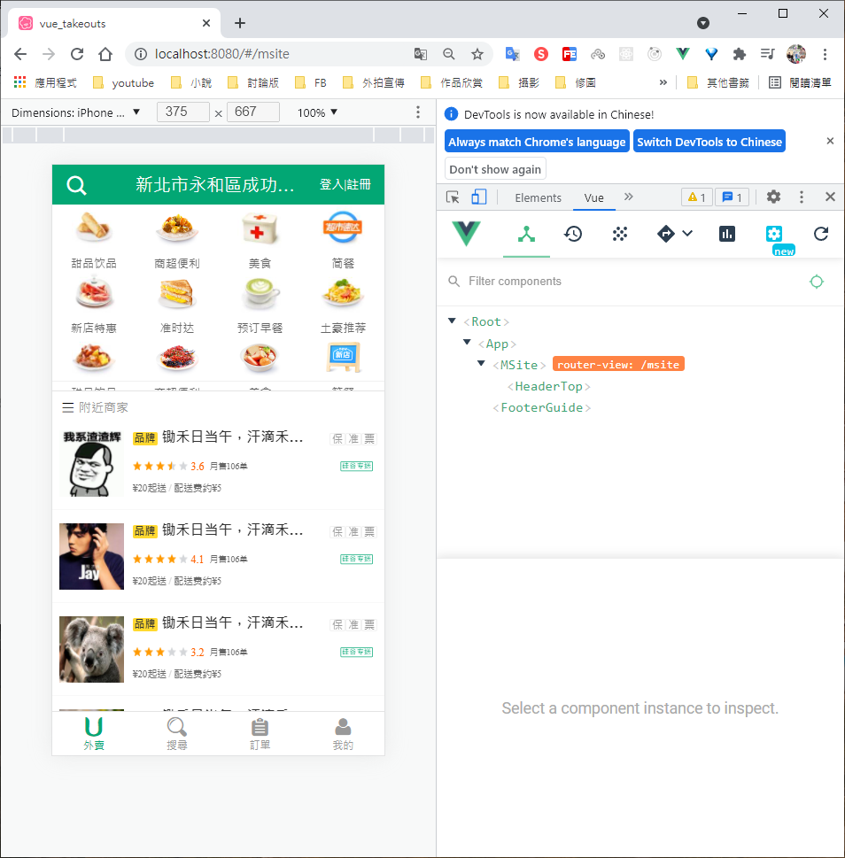

# 完成影片

待補

# 使用技術

Vue、VueX、vue-router

# 建立新專案

```bash
vue init webpack vue_takeouts
```

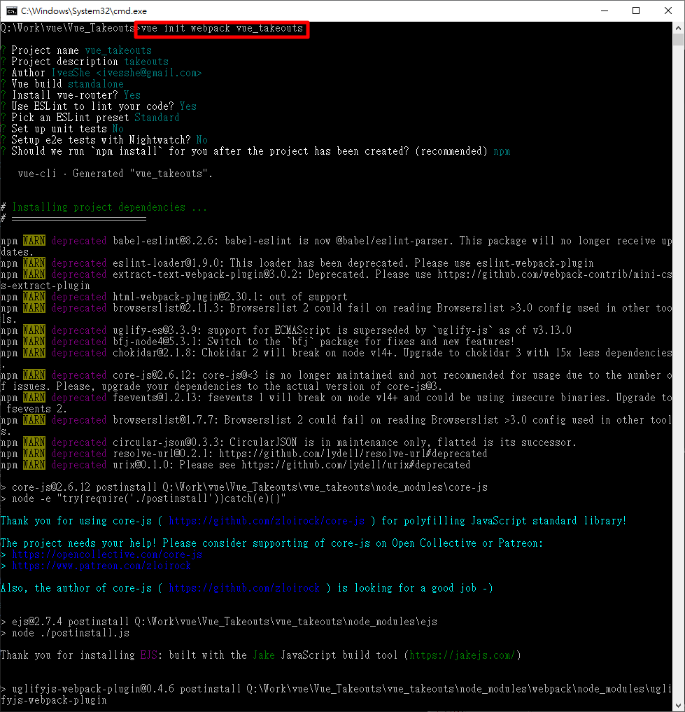

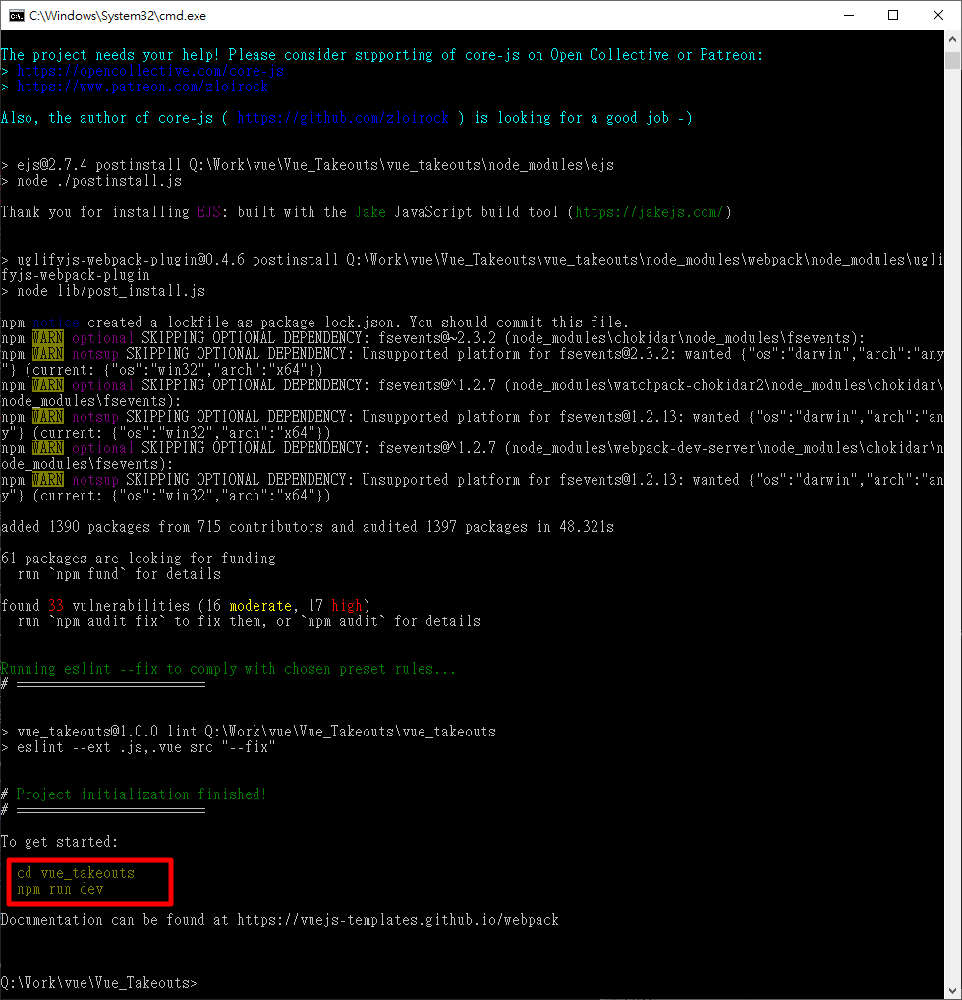

```bash
cd vue_takeouts
npm run dev
```

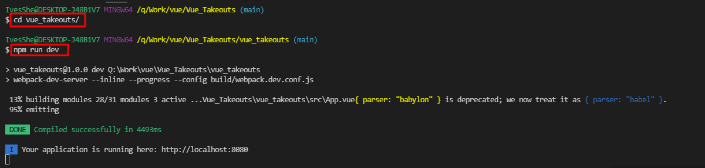


# 建立資料夾結構

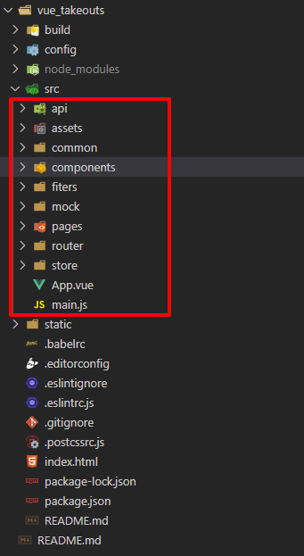

# 安裝stylus依賴包

這裡必須指定版本，不然後續complie會報錯

```bash
npm i stylus@0.54.5 stylus-loader@3.0.2 --save--dev
```

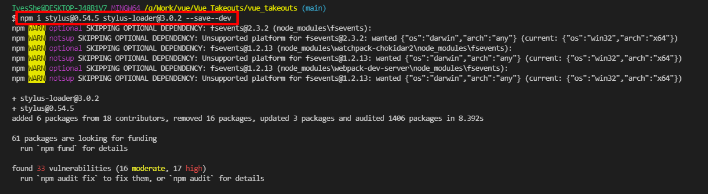

# 建立vue-router及對應組件

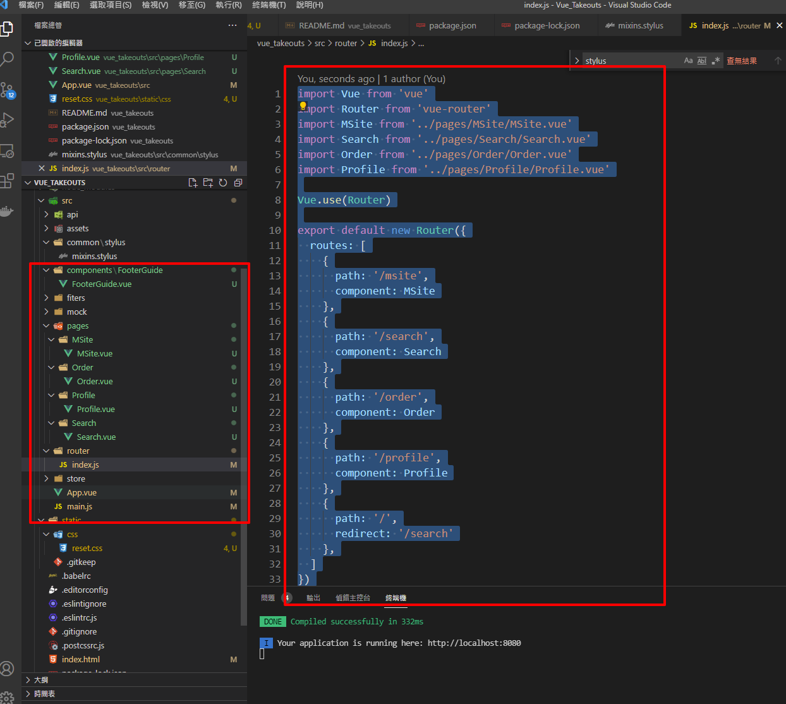

# FooterGuide組件

FooterGuide.vue

```js
<template>
  <div class="footer_guide">
    <span class="guide_item" :class="{on: '/msite'===$route.path}" @click="goTo('/msite')">
      <span class="item_icon">
        <i class="iconfont icon-waimai"></i>
      </span>
      <span>外賣</span>
    </span>
    <span class="guide_item" :class="{on: '/search'===$route.path}"  @click="goTo('/search')">
      <span class="item_icon">
        <i class="iconfont icon-search"></i>
      </span>
      <span>搜尋</span>
    </span>
    <span class="guide_item" :class="{on: '/order'===$route.path}"  @click="goTo('/order')">
      <span class="item_icon">
        <i class="iconfont icon-dingdan"></i>
      </span>
      <span>訂單</span>
    </span>
    <span class="guide_item" :class="{on: '/profile'===$route.path}"  @click="goTo('/profile')">
      <span class="item_icon">
        <i class="iconfont icon-geren"></i>
      </span>
      <span>我的</span>
    </span>
  </div>
</template>

<script>
export default {
  methods: {
    goTo (path) {
      this.$router.replace(path)
    }
  },
}
</script>

<style lang="stylus" rel="stylesheet/stylus">
  @import "../../common/stylus/mixins.stylus"
  .footer_guide  //footer
    top-border-1px(#e4e4e4)
    position fixed
    z-index 100
    left 0
    right 0
    bottom 0
    background-color #fff
    width 100%
    height 50px
    display flex
    .guide_item
      display flex
      flex 1
      text-align center
      flex-direction column
      align-items center
      margin 5px
      color #999999
      &.on
        color #02a774
      span
        font-size 12px
        margin-top 2px
        margin-bottom 2px
        .iconfont
          font-size 22px
  
</style>
```

# 完成外賣(MSite)、搜索(Search)、訂單(Order)、我的(Profile)組件

並將上方共同的Header，抽取成HeaderTop組件

## HeaderTop.vue

預留左右兩個slot

```js
<template>
    <!--首頁頭部-->
    <header class="header">
        <slot name="left"></slot>
        <span class="header_title">
        <span class="header_title_text ellipsis">{{title}}</span>
        </span>
        <slot name="right"></slot>
</header>
</template>

<script>
export default {
    props: {
        title: String
    }
}
</script>

<style lang="stylus" rel="stylesheet/stylus">
    @import "../../common/stylus/mixins.stylus"
    .header
      background-color #02a774
      position fixed
      z-index 100
      left 0
      top 0
      width 100%
      height 45px
      .header_search
        position absolute
        left 15px
        top 50%
        transform translateY(-50%)
        width 10%
        height 50%
        .icon-sousuo
          font-size 25px
          color #fff
      .header_title
        position absolute
        top 50%
        left 50%
        transform translate(-50%, -50%)
        width 50%
        color #fff
        text-align center
        .header_title_text
          font-size 20px
          color #fff
          display block
      .header_login
        font-size 14px
        color #fff
        position absolute
        right 15px
        top 50%
        transform translateY(-50%)
        .header_login_text
          color #fff
</style>
```

## MSite.vue

```js
<template>
  <section class="msite">
    <!--首頁頭部-->
    <header-top title="新北市永和區成功路一段85號(7-11麗金門市)">
      <span class="header_search" slot="left">
        <i class="iconfont icon-sousuo"></i>
      </span>
      <span class="header_login" slot="right">
        <span class="header_login_text">登入|註冊</span>
      </span>
    </header-top>
    
    <!--首頁導航-->
    <nav class="msite_nav">
      <div class="swiper-container">
        <div class="swiper-wrapper">
          <div class="swiper-slide">
            <a href="javascript:" class="link_to_food">
              <div class="food_container">
                
              </div>
              <span>甜品饮品</span>
            </a>
            <a href="javascript:" class="link_to_food">
              <div class="food_container">
                
              </div>
              <span>商超便利</span>
            </a>
            <a href="javascript:" class="link_to_food">
              <div class="food_container">
                
              </div>
              <span>美食</span>
            </a>
            <a href="javascript:" class="link_to_food">
              <div class="food_container">
                
              </div>
              <span>简餐</span>
            </a>
            <a href="javascript:" class="link_to_food">
              <div class="food_container">
                
              </div>
              <span>新店特惠</span>
            </a>
            <a href="javascript:" class="link_to_food">
              <div class="food_container">
                
              </div>
              <span>准时达</span>
            </a>
            <a href="javascript:" class="link_to_food">
              <div class="food_container">
                
              </div>
              <span>预订早餐</span>
            </a>
            <a href="javascript:" class="link_to_food">
              <div class="food_container">
                
              </div>
              <span>土豪推荐</span>
            </a>
          </div>
          <div class="swiper-slide">
            <a href="javascript:" class="link_to_food">
              <div class="food_container">
                
              </div>
              <span>甜品饮品</span>
            </a>
            <a href="javascript:" class="link_to_food">
              <div class="food_container">
                
              </div>
              <span>商超便利</span>
            </a>
            <a href="javascript:" class="link_to_food">
              <div class="food_container">
                
              </div>
              <span>美食</span>
            </a>
            <a href="javascript:" class="link_to_food">
              <div class="food_container">
                
              </div>
              <span>简餐</span>
            </a>
            <a href="javascript:" class="link_to_food">
              <div class="food_container">
                
              </div>
              <span>新店特惠</span>
            </a>
            <a href="javascript:" class="link_to_food">
              <div class="food_container">
                
              </div>
              <span>准时达</span>
            </a>
            <a href="javascript:" class="link_to_food">
              <div class="food_container">
                
              </div>
              <span>预订早餐</span>
            </a>
            <a href="javascript:" class="link_to_food">
              <div class="food_container">
                
              </div>
              <span>土豪推荐</span>
            </a>
          </div>
        </div>
        <!-- Add Pagination -->
        <div class="swiper-pagination"></div>
      </div>
    </nav>
    <!--首頁附近商家-->
    <div class="msite_shop_list">
      <div class="shop_header">
        <i class="iconfont icon-xuanxiang"></i>
        <span class="shop_header_title">附近商家</span>
      </div>
      <div class="shop_container">
        <ul class="shop_list">
          <li class="shop_li border-1px">
            <a>
              <div class="shop_left">
                
              </div>
              <div class="shop_right">
                <section class="shop_detail_header">
                  <h4 class="shop_title ellipsis">锄禾日当午，汗滴禾下土</h4>
                  <ul class="shop_detail_ul">
                    <li class="supports">保</li>
                    <li class="supports">准</li>
                    <li class="supports">票</li>
                  </ul>
                </section>
                <section class="shop_rating_order">
                  <section class="shop_rating_order_left">
                    <div class="star star-24">
                      <span class="star-item on"></span>
                      <span class="star-item on"></span>
                      <span class="star-item on"></span>
                      <span class="star-item half"></span>
                      <span class="star-item off"></span>
                    </div>
                    <div class="rating_section">
                      3.6
                    </div>
                    <div class="order_section">
                      月售106单
                    </div>
                  </section>
                  <section class="shop_rating_order_right">
                    <span class="delivery_style delivery_right">硅谷专送</span>
                  </section>
                </section>
                <section class="shop_distance">
                  <p class="shop_delivery_msg">
                    <span>¥20起送</span>
                    <span class="segmentation">/</span>
                    <span>配送费约¥5</span>
                  </p>
                </section>
              </div>
            </a>
          </li>
          <li class="shop_li border-1px">
            <a>
              <div class="shop_left">
                
              </div>
              <div class="shop_right">
                <section class="shop_detail_header">
                  <h4 class="shop_title ellipsis">锄禾日当午，汗滴禾下土</h4>
                  <ul class="shop_detail_ul">
                    <li class="supports">保</li>
                    <li class="supports">准</li>
                    <li class="supports">票</li>
                  </ul>
                </section>
                <section class="shop_rating_order">
                  <section class="shop_rating_order_left">
                    <div class="star star-24">
                      <span class="star-item on"></span>
                      <span class="star-item on"></span>
                      <span class="star-item on"></span>
                      <span class="star-item on"></span>
                      <span class="star-item off"></span>
                    </div>
                    <div class="rating_section">
                      4.1
                    </div>
                    <div class="order_section">
                      月售106单
                    </div>
                  </section>
                  <section class="shop_rating_order_right">
                    <span class="delivery_style delivery_right">硅谷专送</span>
                  </section>
                </section>
                <section class="shop_distance">
                  <p class="shop_delivery_msg">
                    <span>¥20起送</span>
                    <span class="segmentation">/</span>
                    <span>配送费约¥5</span>
                  </p>
                </section>
              </div>
            </a>
          </li>
          <li class="shop_li border-1px">
            <a>
              <div class="shop_left">
                
              </div>
              <div class="shop_right">
                <section class="shop_detail_header">
                  <h4 class="shop_title ellipsis">锄禾日当午，汗滴禾下土</h4>
                  <ul class="shop_detail_ul">
                    <li class="supports">保</li>
                    <li class="supports">准</li>
                    <li class="supports">票</li>
                  </ul>
                </section>
                <section class="shop_rating_order">
                  <section class="shop_rating_order_left">
                    <div class="star star-24">
                      <span class="star-item on"></span>
                      <span class="star-item on"></span>
                      <span class="star-item on"></span>
                      <span class="star-item off"></span>
                      <span class="star-item off"></span>
                    </div>
                    <div class="rating_section">
                      3.2
                    </div>
                    <div class="order_section">
                      月售106单
                    </div>
                  </section>
                  <section class="shop_rating_order_right">
                    <span class="delivery_style delivery_right">硅谷专送</span>
                  </section>
                </section>
                <section class="shop_distance">
                  <p class="shop_delivery_msg">
                    <span>¥20起送</span>
                    <span class="segmentation">/</span>
                    <span>配送费约¥5</span>
                  </p>
                </section>
              </div>
            </a>
          </li>
          <li class="shop_li border-1px">
            <a>
              <div class="shop_left">
                
              </div>
              <div class="shop_right">
                <section class="shop_detail_header">
                  <h4 class="shop_title ellipsis">锄禾日当午，汗滴禾下土</h4>
                  <ul class="shop_detail_ul">
                    <li class="supports">保</li>
                    <li class="supports">准</li>
                    <li class="supports">票</li>
                  </ul>
                </section>
                <section class="shop_rating_order">
                  <section class="shop_rating_order_left">
                    <div class="star star-24">
                      <span class="star-item on"></span>
                      <span class="star-item on"></span>
                      <span class="star-item on"></span>
                      <span class="star-item half"></span>
                      <span class="star-item off"></span>
                    </div>
                    <div class="rating_section">
                      3.6
                    </div>
                    <div class="order_section">
                      月售106单
                    </div>
                  </section>
                  <section class="shop_rating_order_right">
                    <span class="delivery_style delivery_right">硅谷专送</span>
                  </section>
                </section>
                <section class="shop_distance">
                  <p class="shop_delivery_msg">
                    <span>¥20起送</span>
                    <span class="segmentation">/</span>
                    <span>配送费约¥5</span>
                  </p>
                </section>
              </div>
            </a>
          </li>
        </ul>
      </div>
    </div>
  </section>
</template>

<script>
import HeaderTop from '../../components/HeaderTop/HeaderTop.vue'
export default {
  components:{
    HeaderTop
  }
}
</script>

<style lang="stylus" rel="stylesheet/stylus">
  @import "../../common/stylus/mixins.stylus"
  .msite  //首頁
    width 100%    
    .msite_nav
      bottom-border-1px(#e4e4e4)
      margin-top 45px
      height 200px
      background #fff
      .swiper-container
        width 100%
        height 100%
        .swiper-wrapper
          width 100%
          height 100%
          .swiper-slide
            display flex
            justify-content center
            align-items flex-start
            flex-wrap wrap
            .link_to_food
              width 25%
              .food_container
                display block
                width 100%
                text-align center
                padding-bottom 10px
                font-size 0
                img
                  display inline-block
                  width 50px
                  height 50px
              span
                display block
                width 100%
                text-align center
                font-size 13px
                color #666
        .swiper-pagination
          >span.swiper-pagination-bullet-active
            background #02a774
    .msite_shop_list
      top-border-1px(#e4e4e4)
      margin-top 10px
      background #fff
      .shop_header
        padding 10px 10px 0
        .shop_icon
          margin-left 5px
          color #999
        .shop_header_title
          color #999
          font-size 14px
          line-height 20px
      .shop_container
        margin-bottom 50px
        .shop_list
          .shop_li
            bottom-border-1px(#f1f1f1)
            width 100%
            >a
              clearFix()
              display block
              box-sizing border-box
              padding 15px 8px
              width 100%
              .shop_left
                float left
                box-sizing border-box
                width 23%
                height 75px
                padding-right 10px
                .shop_img
                  display block
                  width 100%
                  height 100%
              .shop_right
                float right
                width 77%
                .shop_detail_header
                  clearFix()
                  width 100%
                  .shop_title
                    float left
                    width 200px
                    color #333
                    font-size 16px
                    line-height 16px
                    font-weight 700
                    &::before
                      content '品牌'
                      display inline-block
                      font-size 11px
                      line-height 11px
                      color #333
                      background-color #ffd930
                      padding 2px 2px
                      border-radius 2px
                      margin-right 5px
                  .shop_detail_ul
                    float right
                    margin-top 3px
                    .supports
                      float left
                      font-size 10px
                      color #999
                      border 1px solid #f1f1f1
                      padding 0 2px
                      border-radius 2px
                .shop_rating_order
                  clearFix()
                  width 100%
                  margin-top 18px
                  margin-bottom 8px
                  .shop_rating_order_left
                    float left
                    color #ff9a0d
                    .star //2x图 3x图
                      float left
                      font-size 0
                      .star-item
                        display inline-block
                        background-repeat no-repeat
                      &.star-48
                        .star-item
                          width 20px
                          height 20px
                          margin-right 22px
                          background-size 20px 20px
                          &:last-child
                            margin-right: 0
                          &.on
                            bg-image('./images/stars/star48_on')
                          &.half
                            bg-image('./images/stars/star48_half')
                          &.off
                            bg-image('./images/stars/star48_off')
                      &.star-36
                        .star-item
                          width 15px
                          height 15px
                          margin-right 6px
                          background-size 15px 15px
                          &:last-child
                            margin-right 0
                          &.on
                            bg-image('./images/stars/star36_on')
                          &.half
                            bg-image('./images/stars/star36_half')
                          &.off
                            bg-image('./images/stars/star36_off')
                      &.star-24
                        .star-item
                          width 10px
                          height 10px
                          margin-right 3px
                          background-size 10px 10px
                          &:last-child
                            margin-right 0
                          &.on
                            bg-image('./images/stars/star24_on')
                          &.half
                            bg-image('./images/stars/star24_half')
                          &.off
                            bg-image('./images/stars/star24_off')
                    .rating_section
                      float left
                      font-size 10px
                      color #ff6000
                      margin-left 4px
                    .order_section
                      float left
                      font-size 10px
                      color #666
                      transform scale(.8)
                  .shop_rating_order_right
                    float right
                    font-size 0
                    .delivery_style
                      transform-origin 35px 0
                      transform scale(.7)
                      display inline-block
                      font-size 12px
                      padding 1px
                      border-radius 2px
                    .delivery_left
                      color #fff
                      margin-right -10px
                      background-color #02a774
                      border 1px solid #02a774
                    .delivery_right
                      color #02a774
                      border 1px solid #02a774
                .shop_distance
                  clearFix()
                  width 100%
                  font-size 12px
                  .shop_delivery_msg
                    float left
                    transform-origin 0
                    transform scale(.9)
                    color #666
                  .segmentation
                    color #ccc
  
</style>

```

## Search.vue

```js
<template>
  <div class="search">
    <header-top title="搜尋"></header-top>
    <form class="search_form" action="#">
      <input type="search" name="search" placeholder="請輸入商家或美食名稱" class="search_input">
      <input type="submit" name="submit" class="search_submit">
    </form>
  </div>
</template>

<script>
import HeaderTop from '../../components/HeaderTop/HeaderTop.vue'
export default {
  components:{
    HeaderTop
  }
}
</script>

<style lang="stylus" rel="stylesheet/stylus">
  @import "../../common/stylus/mixins.stylus"
  .search  //搜尋
    width 100%    
    .search_form
      clearFix()
      margin-top 45px
      background-color #fff
      padding 12px 8px
      input
        height 35px
        padding 0 4px
        border-radius 2px
        font-weight bold
        outline none
        &.search_input
          float left
          width 79%
          border 4px solid #f2f2f2
          font-size 14px
          color #333
          background-color #f2f2f2
        &.search_submit
          float right
          width 18%
          border 4px solid #02a774
          font-size 16px
          color #fff
          background-color #02a774
    
</style>

```

## Order.vue

```js
<template>
  <div class="order">
    <header-top title="訂單列表"></header-top>    
    <section class="order_no_login">
      
      <h3>登入後查看外賣訂單</h3>
      <button>立即登入</button>
    </section>
  </div>
</template>

<script>
import HeaderTop from '../../components/HeaderTop/HeaderTop.vue'
export default {
  components:{
    HeaderTop
  }
}
</script>

<style lang="stylus" rel="stylesheet/stylus">
  @import "../../common/stylus/mixins.stylus"
  .order  //訂單
    width 100%    
    .order_no_login
      padding-top 140px
      width 60%
      margin 0 auto
      text-align center
      >img
        display block 
        width 100%
        height 30%
      >h3
        padding 10px 0
        font-size 17px
        color #6a6a6a
      >button
        display inline-block
        background #02a774
        font-size 14px
        color #fff
        border 0
        outline none
        border-radius 5px
        padding 10px 20px
  
</style>

```

## Profile.vue

```js
<template>
  <section class="profile">
    <header-top title="我的"></header-top>    
    <section class="profile-number">
      <a href="javascript:" class="profile-link">
        <div class="profile_image">
          <i class="iconfont icon-person"></i>
        </div>
        <div class="user-info">
          <p class="user-info-top">登入/註冊</p>
          <p>
            <span class="user-icon">
              <i class="iconfont icon-shouji icon-mobile"></i>
            </span>
            <span class="icon-mobile-number">暫無綁定手機號</span>
          </p>
        </div>
        <span class="arrow">
          <i class="iconfont icon-jiantou1"></i>
        </span>
      </a>
    </section>
    <section class="profile_info_data border-1px">
      <ul class="info_data_list">
        <a href="javascript:" class="info_data_link">
          <span class="info_data_top"><span>0.00</span>元</span>
          <span class="info_data_bottom">我的餘額</span>
        </a>
        <a href="javascript:" class="info_data_link">
          <span class="info_data_top"><span>0</span>个</span>
          <span class="info_data_bottom">我的優惠</span>
        </a>
        <a href="javascript:" class="info_data_link">
          <span class="info_data_top"><span>0</span>分</span>
          <span class="info_data_bottom">我的積分</span>
        </a>
      </ul>
    </section>
    <section class="profile_my_order border-1px">
      <!-- 我的訂單 -->
      <a href='javascript:' class="my_order">
        <span>
          <i class="iconfont icon-order-s"></i>
        </span>
        <div class="my_order_div">
          <span>我的訂單</span>
          <span class="my_order_icon">
            <i class="iconfont icon-jiantou1"></i>
          </span>
        </div>
      </a>
      <!-- 積分商城 -->
      <a href='javascript:' class="my_order">
        <span>
          <i class="iconfont icon-jifen"></i>
        </span>
        <div class="my_order_div">
          <span>積分商城</span>
          <span class="my_order_icon">
            <i class="iconfont icon-jiantou1"></i>
          </span>
        </div>
      </a>
      <!-- 7-11外賣會員卡 -->
      <a href="javascript:" class="my_order">
        <span>
          <i class="iconfont icon-vip"></i>
        </span>
        <div class="my_order_div">
          <span>7-11外賣會員卡</span>
          <span class="my_order_icon">
            <i class="iconfont icon-jiantou1"></i>
          </span>
        </div>
      </a>
    </section>
    <section class="profile_my_order border-1px">
      <!-- 服務中心 -->
      <a href="javascript:" class="my_order">
        <span>
          <i class="iconfont icon-fuwu"></i>
        </span>
        <div class="my_order_div">
          <span>服務中心</span>
          <span class="my_order_icon">
            <i class="iconfont icon-jiantou1"></i>
          </span>
        </div>
      </a>
    </section>
  </section>
</template>

<script>
import HeaderTop from '../../components/HeaderTop/HeaderTop.vue'
export default {
  components:{
    HeaderTop
  }
}
</script>

<style lang="stylus" rel="stylesheet/stylus">
  @import "../../common/stylus/mixins.stylus"
  .profile //我的
    width 100%    
    .profile-number
      margin-top 45.5px
      .profile-link
        clearFix()
        position relative
        display block
        background #02a774
        padding 20px 10px
        .profile_image
          float left
          width 60px
          height 60px
          border-radius 50%
          overflow hidden
          vertical-align top
          .icon-person
            background #e4e4e4
            font-size 62px
        .user-info
          float left
          margin-top 8px
          margin-left 15px
          p
            font-weight: 700
            font-size 18px
            color #fff
            &.user-info-top
              padding-bottom 8px
            .user-icon
              display inline-block
              margin-left -15px
              margin-right 5px
              width 20px
              height 20px
              .icon-mobile
                font-size 30px
                vertical-align text-top
            .icon-mobile-number
              font-size 14px
              color #fff
        .arrow
          width 12px
          height 12px
          position absolute
          right 15px
          top 40%
          .icon-jiantou1
            color #fff
            font-size 5px
    .profile_info_data
      bottom-border-1px(#e4e4e4)
      width 100%
      background #fff
      overflow hidden
      .info_data_list
        clearFix()
        .info_data_link
          float left
          width 33%
          text-align center
          border-right 1px solid #f1f1f1
          .info_data_top
            display block
            width 100%
            font-size 14px
            color #333
            padding 15px 5px 10px
            span
              display inline-block
              font-size 30px
              color #f90
              font-weight 700
              line-height 30px
          .info_data_bottom
            display inline-block
            font-size 14px
            color #666
            font-weight 400
            padding-bottom 10px
        .info_data_link:nth-of-type(2)
          .info_data_top
            span
              color #ff5f3e
        .info_data_link:nth-of-type(3)
          border 0
          .info_data_top
            span
              color #6ac20b
    .profile_my_order
      top-border-1px(#e4e4e4)
      margin-top 10px
      background #fff
      .my_order
        display flex
        align-items center
        padding-left 15px
        >span
          display flex
          align-items center
          width 20px
          height 20px
          >.iconfont
            margin-left -10px
            font-size 30px
          .icon-order-s
            color #02a774
          .icon-jifen
            color #ff5f3e
          .icon-vip
            color #f90
          .icon-fuwu
            color #02a774
        .my_order_div
          width 100%
          border-bottom 1px solid #f1f1f1
          padding 18px 10px 18px 0
          font-size 16px
          color #333
          display flex
          justify-content space-between
          span
            display block
          .my_order_icon
            width 10px
            height 10px
            .icon-jiantou1
              color #bbb
              font-size 10px

</style>

```

## 完成圖


# 使用Swiper輪播插件


https://www.swiper.com.cn/


安裝

```bash
npm i swiper@4 --save
```

使用方法

https://www.swiper.com.cn/usage/index.html


MSite.vue 引入

```js
import Swiper from 'swiper'
import 'swiper/dist/css/swiper.min.css'
```

# 抽取ShopList組件

MSite抽取ShopList組件

## ShopList.vue

```js
<template>
  <div class="shop_container">
    <ul class="shop_list">
      <li class="shop_li border-1px">
      <a>
          <div class="shop_left">
          
          </div>
          <div class="shop_right">
          <section class="shop_detail_header">
              <h4 class="shop_title ellipsis">锄禾日当午，汗滴禾下土</h4>
              <ul class="shop_detail_ul">
              <li class="supports">保</li>
              <li class="supports">准</li>
              <li class="supports">票</li>
              </ul>
          </section>
          <section class="shop_rating_order">
              <section class="shop_rating_order_left">
              <div class="star star-24">
                  <span class="star-item on"></span>
                  <span class="star-item on"></span>
                  <span class="star-item on"></span>
                  <span class="star-item half"></span>
                  <span class="star-item off"></span>
              </div>
              <div class="rating_section">
                  3.6
              </div>
              <div class="order_section">
                  月售106单
              </div>
              </section>
              <section class="shop_rating_order_right">
              <span class="delivery_style delivery_right">硅谷专送</span>
              </section>
          </section>
          <section class="shop_distance">
              <p class="shop_delivery_msg">
              <span>¥20起送</span>
              <span class="segmentation">/</span>
              <span>配送费约¥5</span>
              </p>
          </section>
          </div>
      </a>
      </li>
      <li class="shop_li border-1px">
      <a>
          <div class="shop_left">
          
          </div>
          <div class="shop_right">
          <section class="shop_detail_header">
              <h4 class="shop_title ellipsis">锄禾日当午，汗滴禾下土</h4>
              <ul class="shop_detail_ul">
              <li class="supports">保</li>
              <li class="supports">准</li>
              <li class="supports">票</li>
              </ul>
          </section>
          <section class="shop_rating_order">
              <section class="shop_rating_order_left">
              <div class="star star-24">
                  <span class="star-item on"></span>
                  <span class="star-item on"></span>
                  <span class="star-item on"></span>
                  <span class="star-item on"></span>
                  <span class="star-item off"></span>
              </div>
              <div class="rating_section">
                  4.1
              </div>
              <div class="order_section">
                  月售106单
              </div>
              </section>
              <section class="shop_rating_order_right">
              <span class="delivery_style delivery_right">硅谷专送</span>
              </section>
          </section>
          <section class="shop_distance">
              <p class="shop_delivery_msg">
              <span>¥20起送</span>
              <span class="segmentation">/</span>
              <span>配送费约¥5</span>
              </p>
          </section>
          </div>
      </a>
      </li>
      <li class="shop_li border-1px">
      <a>
          <div class="shop_left">
          
          </div>
          <div class="shop_right">
          <section class="shop_detail_header">
              <h4 class="shop_title ellipsis">锄禾日当午，汗滴禾下土</h4>
              <ul class="shop_detail_ul">
              <li class="supports">保</li>
              <li class="supports">准</li>
              <li class="supports">票</li>
              </ul>
          </section>
          <section class="shop_rating_order">
              <section class="shop_rating_order_left">
              <div class="star star-24">
                  <span class="star-item on"></span>
                  <span class="star-item on"></span>
                  <span class="star-item on"></span>
                  <span class="star-item off"></span>
                  <span class="star-item off"></span>
              </div>
              <div class="rating_section">
                  3.2
              </div>
              <div class="order_section">
                  月售106单
              </div>
              </section>
              <section class="shop_rating_order_right">
              <span class="delivery_style delivery_right">硅谷专送</span>
              </section>
          </section>
          <section class="shop_distance">
              <p class="shop_delivery_msg">
              <span>¥20起送</span>
              <span class="segmentation">/</span>
              <span>配送费约¥5</span>
              </p>
          </section>
          </div>
      </a>
      </li>
      <li class="shop_li border-1px">
      <a>
          <div class="shop_left">
          
          </div>
          <div class="shop_right">
          <section class="shop_detail_header">
              <h4 class="shop_title ellipsis">锄禾日当午，汗滴禾下土</h4>
              <ul class="shop_detail_ul">
              <li class="supports">保</li>
              <li class="supports">准</li>
              <li class="supports">票</li>
              </ul>
          </section>
          <section class="shop_rating_order">
              <section class="shop_rating_order_left">
              <div class="star star-24">
                  <span class="star-item on"></span>
                  <span class="star-item on"></span>
                  <span class="star-item on"></span>
                  <span class="star-item half"></span>
                  <span class="star-item off"></span>
              </div>
              <div class="rating_section">
                  3.6
              </div>
              <div class="order_section">
                  月售106单
              </div>
              </section>
              <section class="shop_rating_order_right">
              <span class="delivery_style delivery_right">硅谷专送</span>
              </section>
          </section>
          <section class="shop_distance">
              <p class="shop_delivery_msg">
              <span>¥20起送</span>
              <span class="segmentation">/</span>
              <span>配送费约¥5</span>
              </p>
          </section>
          </div>
      </a>
      </li>
    </ul>
  </div>    
</template>

<script>
export default {
    props: {
    }
}
</script>

<style lang="stylus" rel="stylesheet/stylus">
    @import "../../common/stylus/mixins.stylus"
    .shop_container
        margin-bottom 50px
        .shop_list
          .shop_li
            bottom-border-1px(#f1f1f1)
            width 100%
            >a
              clearFix()
              display block
              box-sizing border-box
              padding 15px 8px
              width 100%
              .shop_left
                float left
                box-sizing border-box
                width 23%
                height 75px
                padding-right 10px
                .shop_img
                  display block
                  width 100%
                  height 100%
              .shop_right
                float right
                width 77%
                .shop_detail_header
                  clearFix()
                  width 100%
                  .shop_title
                    float left
                    width 200px
                    color #333
                    font-size 16px
                    line-height 16px
                    font-weight 700
                    &::before
                      content '品牌'
                      display inline-block
                      font-size 11px
                      line-height 11px
                      color #333
                      background-color #ffd930
                      padding 2px 2px
                      border-radius 2px
                      margin-right 5px
                  .shop_detail_ul
                    float right
                    margin-top 3px
                    .supports
                      float left
                      font-size 10px
                      color #999
                      border 1px solid #f1f1f1
                      padding 0 2px
                      border-radius 2px
                .shop_rating_order
                  clearFix()
                  width 100%
                  margin-top 18px
                  margin-bottom 8px
                  .shop_rating_order_left
                    float left
                    color #ff9a0d
                    .star //2x图 3x图
                      float left
                      font-size 0
                      .star-item
                        display inline-block
                        background-repeat no-repeat
                      &.star-48
                        .star-item
                          width 20px
                          height 20px
                          margin-right 22px
                          background-size 20px 20px
                          &:last-child
                            margin-right: 0
                          &.on
                            bg-image('./images/stars/star48_on')
                          &.half
                            bg-image('./images/stars/star48_half')
                          &.off
                            bg-image('./images/stars/star48_off')
                      &.star-36
                        .star-item
                          width 15px
                          height 15px
                          margin-right 6px
                          background-size 15px 15px
                          &:last-child
                            margin-right 0
                          &.on
                            bg-image('./images/stars/star36_on')
                          &.half
                            bg-image('./images/stars/star36_half')
                          &.off
                            bg-image('./images/stars/star36_off')
                      &.star-24
                        .star-item
                          width 10px
                          height 10px
                          margin-right 3px
                          background-size 10px 10px
                          &:last-child
                            margin-right 0
                          &.on
                            bg-image('./images/stars/star24_on')
                          &.half
                            bg-image('./images/stars/star24_half')
                          &.off
                            bg-image('./images/stars/star24_off')
                    .rating_section
                      float left
                      font-size 10px
                      color #ff6000
                      margin-left 4px
                    .order_section
                      float left
                      font-size 10px
                      color #666
                      transform scale(.8)
                  .shop_rating_order_right
                    float right
                    font-size 0
                    .delivery_style
                      transform-origin 35px 0
                      transform scale(.7)
                      display inline-block
                      font-size 12px
                      padding 1px
                      border-radius 2px
                    .delivery_left
                      color #fff
                      margin-right -10px
                      background-color #02a774
                      border 1px solid #02a774
                    .delivery_right
                      color #02a774
                      border 1px solid #02a774
                .shop_distance
                  clearFix()
                  width 100%
                  font-size 12px
                  .shop_delivery_msg
                    float left
                    transform-origin 0
                    transform scale(.9)
                    color #666
                  .segmentation
                    color #ccc
</style>
```

# Login組件

## Login.vue

```js
<template>	
	<section class="loginContainer">
		<div class="loginInner">
			<div class="login_header">
				<h2 class="login_logo">7-11外賣</h2>
				<div class="login_header_title">
					<a href="javascript:;" class="on">短信登入</a>
					<a href="javascript:;">密碼登入</a>
				</div>
			</div>
			<div class="login_content">
				<form>
					<div class="on">
						<section class="login_message">
							<input type="tel" maxlength="11" placeholder="手機號">
							<button disabled="disabled" class="get_verification">獲取驗證碼</button>
						</section>
						<section class="login_verification">
							<input type="tel" maxlength="8" placeholder="驗證碼">
						</section>
						<section class="login_hint">
							溫馨提示：未註冊7-11外賣帳號的手機號，登入時將自動註冊，且代表已同意
							<a href="javascript:;">《用戶服務協議》</a>
						</section>
					</div>
					<div>
						<section>
							<section class="login_message">
								<input type="tel" maxlength="11" placeholder="手機/郵箱/用戶名">
							</section>
							<section class="login_verification">
								<input type="tel" maxlength="8" placeholder="密碼">
								<div class="switch_button off">
									<div class="switch_circle"></div>
									<span class="switch_text">...</span>
								</div>
							</section>
							<section class="login_message">
								<input type="text" maxlength="11" placeholder="驗證碼">
								
							</section>
						</section>
					</div>
					<button class="login_submit">登入</button>
				</form>
				<a href="javascript:;" class="about_us">關於我們</a>
			</div>
			<a href="javascript:" class="go_back" @click="$router.back()">
				<i class="iconfont icon-jiantou2"></i>
			</a>
		</div>
	</section>
</template>

<script>
export default {
    props: {
    }
}
</script>

<style lang="stylus" rel="stylesheet/stylus">
    @import "../../common/stylus/mixins.stylus"
    .loginContainer
      width 100%
      height 100%
      background #fff
      .loginInner
        padding-top 60px
        width 80%
        margin 0 auto
        .login_header
          .login_logo
            font-size 40px
            font-weight bold
            color #02a774
            text-align center
          .login_header_title
            padding-top 40px
            text-align center
            >a
              color #333
              font-size 14px
              padding-bottom 4px
              &:first-child
                margin-right 40px
              &.on
                color #02a774
                font-weight 700
                border-bottom 2px solid #02a774
        .login_content
          >form
            >div
              display none
              &.on
                display block
              input
                width 100%
                height 100%
                padding-left 10px
                box-sizing border-box
                border 1px solid #ddd
                border-radius 4px
                outline 0
                font 400 14px Arial
                &:focus
                  border 1px solid #02a774
              .login_message
                position relative
                margin-top 16px
                height 48px
                font-size 14px
                background #fff
                .get_verification
                  position absolute
                  top 50%
                  right 10px
                  transform translateY(-50%)
                  border 0
                  color #ccc
                  font-size 14px
                  background transparent
              .login_verification
                position relative
                margin-top 16px
                height 48px
                font-size 14px
                background #fff
                .switch_button
                  font-size 12px
                  border 1px solid #ddd
                  border-radius 8px
                  transition background-color .3s,border-color .3s
                  padding 0 6px
                  width 30px
                  height 16px
                  line-height 16px
                  color #fff
                  position absolute
                  top 50%
                  right 10px
                  transform translateY(-50%)
                  &.off
                    background #fff
                    .switch_text
                      float right
                      color #ddd
                  &.on
                    background #02a774
                  >.switch_circle
                    //transform translateX(27px)
                    position absolute
                    top -1px
                    left -1px
                    width 16px
                    height 16px
                    border 1px solid #ddd
                    border-radius 50%
                    background #fff
                    box-shadow 0 2px 4px 0 rgba(0,0,0,.1)
                    transition transform .3s
              .login_hint
                margin-top 12px
                color #999
                font-size 14px
                line-height 20px
                >a
                  color #02a774
            .login_submit
              display block
              width 100%
              height 42px
              margin-top 30px
              border-radius 4px
              background #4cd96f
              color #fff
              text-align center
              font-size 16px
              line-height 42px
              border 0
          .about_us
            display block
            font-size 12px
            margin-top 20px
            text-align center
            color #999
        .go_back
          position absolute
          top 5px
          left 5px
          width 30px
          height 30px
          >.iconfont
            font-size 20px
            color #999
</style>
```

# 修改router.js

設定條件，只有這些組件才秀FooterGuide組件


```js
import Vue from 'vue'
import Router from 'vue-router'
import MSite from '../pages/MSite/MSite.vue'
import Search from '../pages/Search/Search.vue'
import Order from '../pages/Order/Order.vue'
import Profile from '../pages/Profile/Profile.vue'
import Login from '../pages/Login/Login.vue'

Vue.use(Router)

export default new Router({
  routes: [
    {
      path: '/msite',
      component: MSite,
      meta: {
        showFooter: true
      }
    },
    {
      path: '/search',
      component: Search,
      meta: {
        showFooter: true
      }
    },
    {
      path: '/order',
      component: Order,
      meta: {
        showFooter: true
      }
    },
    {
      path: '/profile',
      component: Profile,
      meta: {
        showFooter: true
      }
    },
    {
      path: '/login',
      component: Login
    },
    {
      path: '/',
      redirect: '/msite',
    },
  ]
})

```

## App.vue

```js
<template>
  <div id="app">
    <router-view></router-view>
    <FooterGuide v-show="$route.meta.showFooter" />
  </div>
</template>
```

## 完成畫面


login組件不秀FooterGuide

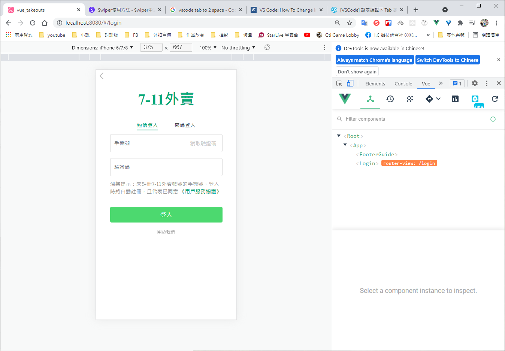

下方四個對應的組件才秀FooterGuide

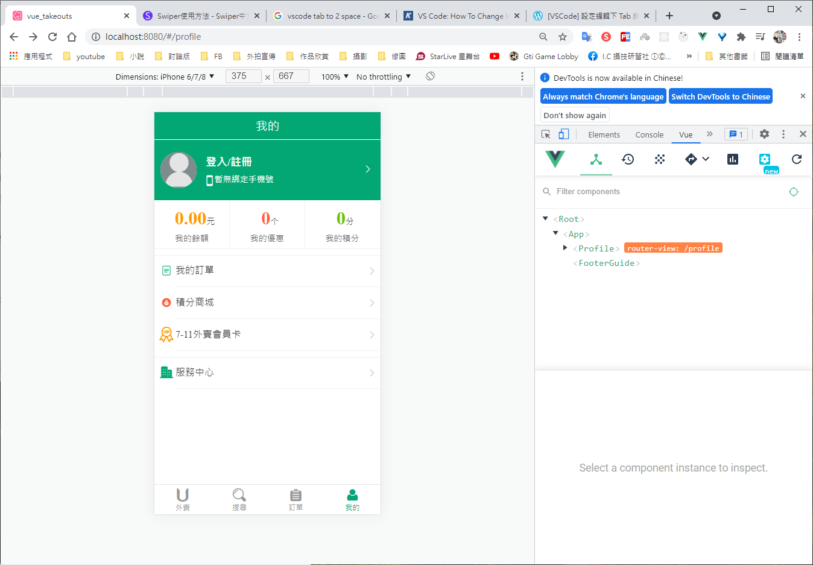

# 封裝Axios模塊

安裝axios

```bash
npm i axios --save
```

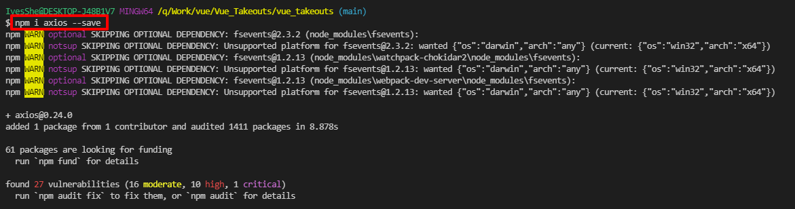

## src/api/ajax.js

```js
/**
 * ajax請求函數模塊
 * 返回值：promise對象
 */
import axios from 'axios'

export default function ajax (url, data={}, type='GET') {

  return new Promise(function (resolve, reject) {
    // 執行異步ajax請求
    let promise
    if (type === 'GET') {
      // 准備url query參數數據
      let dataStr = '' // 數據拼接字符串
      Object.keys(data).forEach(key => {
        dataStr += key + '=' + data[key] + '&'
      })
      if (dataStr !== '') {
        dataStr = dataStr.substring(0, dataStr.lastIndexOf('&'))
        url = url + '?' + dataStr
      }
      // 發送get請求
      promise = axios.get(url)
    } else {
      // 發送post請求
      promise = axios.post(url, data)
    }
    
    promise.then(function (response) {
      // 成功了調用resolve()
      resolve(response.data)
    }).catch(function (error) {
      // 失敗了調用reject()
      reject(error)
    })
  })
}
```

## src/api/index.js

```js
/**
 * 包含n個接口請求函數的模塊
 * 函數的返回值：promise對象
 */

import ajax from './ajax'

const BASE_URL = '/api'

//  1、根據經緯度獲取位置詳情
export const reqAddress = (geohash) => ajax(`${BASE_URL}/position/${geohash}`)
//  2、獲取食品分類列表
export const reqFoodTypes = () => ajax(BASE_URL+'/index_category')
//  3、根據經緯度獲取商舖列表
export const reqShops = (longitude,latitude) => ajax(BASE_URL+'/shops',{longitude,latitude})
```

# 設置代理伺服器

解決跨域的問題

## config/index.js

增加proxyTable這段

```js
module.exports = {
  dev: {
    proxyTable: {
      '/api': { // 匹配所有以 '/api'開頭的請求路徑
        target: 'http://localhost:4000', // 代理目標的基礎路徑
        changeOrigin: true, // 支持跨域 
        pathRewrite: {// 重寫路徑：去掉路徑中開頭的'/api'
          '^/api': ''
        }
      }
    },
  },

}

```

## 在App.vue使用

```js
import {reqFoodTypes} from './api'
export default {

  async mounted() {
    const result = await reqFoodTypes()
    console.log(result)
  },
}
```

## 請求成功

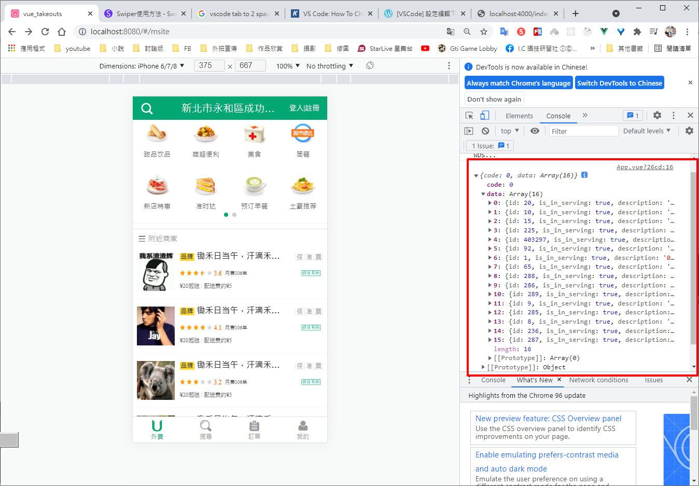

# 創建Vuex整體結構

安裝

```bash
npm i vuex --save
```


建立資料夾及對應檔案

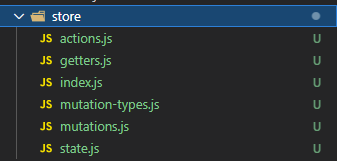

## /src/store/index.js

```js
/**
 * Vuex最核心的管理對象store
 */

import Vue from 'vue'
import Vuex from 'vuex'
import state from './state'
import mutations from './mutations'
import actions from './actions'
import getters from './getters'

Vue.use(Vuex)

export default new Vuex.Store({
  state,
  mutations,
  actions,
  getters
})
```

## /src/store/state.js

```js
/**
 * 狀態對象
 */

export default {
  latitude: 40.168,   // 緯度
  longitude: 116.368, // 經度
  address: {},        // 地址相關信息對象
  categorys: [],      // 食品分類數據
  shops: [],          // 商家數組
}
```

## /src/store/mutations-types.js

```js
/**
 * 包含n個mutation的type名稱常量
 */

export const RECEIVE_ADDRESS = 'receive_address'  // 接收地址
export const RECEIVE_CATEGORYS = 'receive_categorys'  // 接收食品分類數組
export const RECEIVE_SHOPS = 'receive_shops'  // 接收商家數據
```

## /src/store/mutations.js

```js
/**
 * 直接更新state的多個方法的對象
 */

import {
  RECEIVE_ADDRESS,
  RECEIVE_CATEGORYS,
  RECEIVE_SHOPS,
} from './mutation-types'

export default {
  [RECEIVE_ADDRESS] (state,{address}) {
    state.address = address
  },

  [RECEIVE_CATEGORYS] (state,{categorys}) {
    state.categorys = categorys
  },

  [RECEIVE_SHOPS] (state,{shops}) {
    state.shops = shops
  },
}
```

## /src/store/actions.js

```js
/**
 * 通過mutation間接更新state的多個方法的對象
 */
 import {
  RECEIVE_ADDRESS,
  RECEIVE_CATEGORYS,
  RECEIVE_SHOPS,
} from './mutation-types'

import {
  reqAddress,
  reqFoodCategorys,
  reqShops
} from '../api'

export default {
  // 異步獲取地址
  async getAddress ({commit,state}) {
    // 發送異步ajax請求
    const geohash = state.latitude + ',' + state.longitude
    const result = await reqAddress(geohash)
    // 提交一個mutation
    if(result.code === 0){
      const address = result.data
      commit(RECEIVE_ADDRESS,{address})
    }
  },

  // 異步獲取食品分類列表
  async getCategorys ({commit}) {
    // 發送異步ajax請求
    const result = await reqFoodCategorys()
    // 提交一個mutation
    if(result.code === 0){
      const categorys = result.data
      commit(RECEIVE_CATEGORYS,{categorys})
    }
  },

  // 異步獲取商家列表
  async getShops ({commit,state}) {
    // 發送異步ajax請求
    const {longitude,latitude} = state
    const result = await reqShops(longitude,latitude)
    // 提交一個mutation
    if(result.code === 0){
      const shops = result.data
      commit(RECEIVE_SHOPS,{shops})
    }
  },

}
```

## /src/store/getters.js

```js
/**
 * 包含多個基於state的getter計算屬性的對象
 */

export default {
  
}
```

## 在main.js使用

```js
import Vue from 'vue'
import App from './App'
import router from './router'
import store from './store'

Vue.config.productionTip = false

/* eslint-disable no-new */
new Vue({
  el: '#app',  
  render: h=>h(App),
  router,   // 使用上vue-router
  store     // 使用上vuex
})
```

## 在App.vue掛載時dispatch

```js
mounted() {
    this.$store.dispatch('getAddress')
  },
```

## 運行專案

vuex成功運行並存入數據

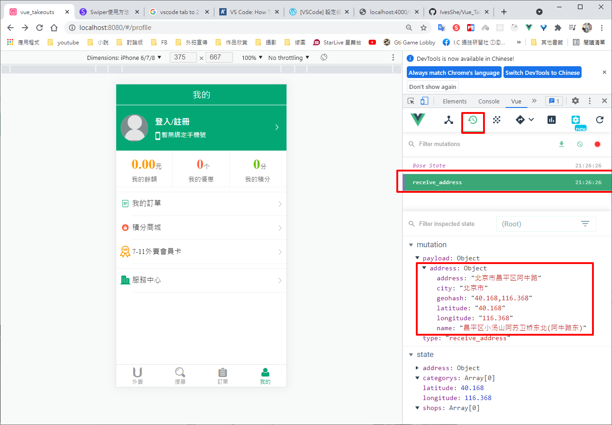

# 使用後端數據

HeaderTop、MSite、ShopList使用後端數據、抽取Star組件、新增讀取時的暫時圖

## App.vue

```js
<template>
  <div id="app">
    <router-view></router-view>
    <FooterGuide v-show="$route.meta.showFooter" />
  </div>
</template>

<script>
//import {reqFoodTypes} from './api'
import {mapActions} from 'vuex'
import FooterGuide from './components/FooterGuide/FooterGuide.vue'

export default {

  mounted() {
    // const result = await reqFoodTypes()
    // console.log(result)
    //this.$store.dispatch('getAddress ')
    this.getAddress()
  },

  methods: {
    ...mapActions(['getAddress'])
  },

  components: {
    FooterGuide,
  }
}
</script>
```

## HeaderTop組件

```js
<template>
  <!--首頁頭部-->
  <header class="header">
      <slot name="left"></slot>
      <span class="header_title">
      <span class="header_title_text ellipsis">{{title}}</span>
      </span>
      <slot name="right"></slot>
  </header>
</template>

<script>

export default {    
    props: {
        title: String
    },
}
</script>
```

## MSite組件

讀取後端數據，並新增讀取時的暫時圖

```js
<template>
  <section class="msite">
    <!--首頁頭部-->
    <header-top :title="address.name">
      <span class="header_search" slot="left">
        <i class="iconfont icon-sousuo"></i>
      </span>
      <span class="header_login" slot="right">
        <span class="header_login_text">登入|註冊</span>
      </span>
    </header-top>
    
    <!--首頁導航-->
    <nav class="msite_nav">
      <div class="swiper-container" v-if="categorys.length">
        <div class="swiper-wrapper">
          <div class="swiper-slide" v-for="(categorys,index) in categorysArr" :key=index>
            <a href="javascript:" class="link_to_food" v-for="(category,index) in categorys" :key=index>
              <div class="food_container">
                
              </div>
              <span>{{category.title}}</span>
            </a>            
          </div>
        </div>
        <!-- Add Pagination -->
        <div class="swiper-pagination"></div>
      </div>
      
    </nav>
    <!--首頁附近商家-->
    <div class="msite_shop_list">
      <div class="shop_header">
        <i class="iconfont icon-xuanxiang"></i>
        <span class="shop_header_title">附近商家</span>
      </div>
      <shop-list></shop-list>
    </div>
  </section>
</template>

<script>
import {mapState} from 'vuex'
import Swiper from 'swiper'
import 'swiper/dist/css/swiper.min.css'

import HeaderTop from '../../components/HeaderTop/HeaderTop.vue'
import ShopList from '../../components/ShopList/ShopList.vue'

export default {

  data(){
    return {
      baseImageUrl: 'https://fuss10.elemecdn.com'
    }
  },

  mounted() {

    this.$store.dispatch('getCategorys')
    this.$store.dispatch('getShops')
    
  },

  computed: {
    ...mapState(['address','categorys']),

    // 根據categorys一維數組生成一個2維數組
    // 小數組中的元素個數最大是8
    categorysArr() {
      const {categorys} = this
      // 准備空的2維數組
      const arr = []
      // 准備一個小數組(最大長度為8)
      let minArr = []
      // 遍歷categorys
      categorys.forEach(c => {
        // 如果當前小數組已經滿了，創建一個新的
        if(minArr.length === 8){
          minArr = []
        }

        // 如果minArr是空的，將小數組保存到大數組中
        if(minArr.length === 0){
          arr.push(minArr)
        }        

        // 將當前分類保存到小數組中
        minArr.push(c)        
      })

      return arr
    }
  },

  watch: {
    categorys(value) {
      // 界面更新就立即創建Swiper對象
      this.$nextTick(()=>{
        // 創建一個Swiper實例對象，來實現輪播
        new Swiper ('.swiper-container', {
          loop: true, // 循环模式选项
          
          // 如果需要分页器
          pagination: {
            el: '.swiper-pagination',
          }
        }) 
      })       
    }
  },

  components:{
    HeaderTop,
    ShopList
  } 
}
</script>
```

## ShopList組件

```js
<template>
  <div class="shop_container">
    <ul class="shop_list" v-if="shops.length">
      <li class="shop_li border-1px" v-for="(shop, index) in shops" :key="index">
      <a>
          <div class="shop_left">
          <!--  -->
          
          </div>
          <div class="shop_right">
          <section class="shop_detail_header">
              <h4 class="shop_title ellipsis">{{shop.name}}</h4>
              <ul class="shop_detail_ul">
                <li class="supports" v-for="(support, index) in shop.supports" :key="index">
                  {{support.icon_name}}
                </li>
              </ul>
          </section>
          <section class="shop_rating_order">
              <section class="shop_rating_order_left">    
              <Star :score="shop.rating" :size="24" />          
              <div class="rating_section">
                  {{shop.rating}}
              </div>
              <div class="order_section">
                  {{shop.recent_order_num}}
              </div>
              </section>
              <section class="shop_rating_order_right">
              <span class="delivery_style delivery_right">{{shop.delivery_mode.text}}</span>
              </section>
          </section>
          <section class="shop_distance">
              <p class="shop_delivery_msg">
              <span>¥{{shop.float_minimum_order_amount}}起送</span>
              <span class="segmentation">/</span>
              <span>配送费约¥{{shop.float_delivery_fee}}</span>
              </p>
          </section>
          </div>
      </a>
      </li>
    </ul>
    <ul v-else>
      <li v-for="item in 6" >
        
      </li>
    </ul>
  </div>    
</template>

<script>
import {mapState} from 'vuex'
import Star from '../Star/Star.vue'

export default {
    data(){
      return {
        //baseImageUrl: 'http://cangdu.org:8001/img/'
        baseImageUrl: './images/shop/',
        fileSubName: '1.jpg'
        // ./images/shop/1.jpg
      }
    },

    computed: {
      ...mapState(['shops'])
    },

    components: {
      Star
    } 
    
}
</script>
```

## Star組件

```js
<template>
  <div class="star" :class="'star-'+size" >
    <span class="star-item" v-for="(sc, index) in starClasses" :class="sc" :key="index" ></span>
  </div>
</template>

<script>
const CLASS_ON = 'on'
const CLASS_HALF = 'half'
const CLASS_OFF = 'off'
export default {  
  props: {
    score: Number,
    size: Number 
  },

  computed: {
    starClasses() {
      const {score} = this
      const scs = []
      // 向scs中添加n個"CLASS_ON"
      const scoreInteger = Math.floor(score)
      for (let i = 0; i < scoreInteger; i++) {
        scs.push(CLASS_ON)        
      }

      // 向scs中添加0/1個"CLASS_HALF"
      if(score*10-scoreInteger*10>=5){
        scs.push(CLASS_HALF)
      }

      // 向scs中添加n個"CLASS_OFF"
      while(scs.length<5){
        scs.push(CLASS_OFF)
      }
      return scs
    }
  }
}
</script>

<style lang="stylus" rel="stylesheet/stylus">
  @import "../../common/stylus/mixins.stylus"
  .star //2x图 3x图
    float left
    font-size 0
    .star-item
      display inline-block
      background-repeat no-repeat
    &.star-48
      .star-item
        width 20px
        height 20px
        margin-right 22px
        background-size 20px 20px
        &:last-child
          margin-right: 0
        &.on
          bg-image('./images/stars/star48_on')
        &.half
          bg-image('./images/stars/star48_half')
        &.off
          bg-image('./images/stars/star48_off')
    &.star-36
      .star-item
        width 15px
        height 15px
        margin-right 6px
        background-size 15px 15px
        &:last-child
          margin-right 0
        &.on
          bg-image('./images/stars/star36_on')
        &.half
          bg-image('./images/stars/star36_half')
        &.off
          bg-image('./images/stars/star36_off')
    &.star-24
      .star-item
        width 10px
        height 10px
        margin-right 3px
        background-size 10px 10px
        &:last-child
          margin-right 0
        &.on
          bg-image('./images/stars/star24_on')
        &.half
          bg-image('./images/stars/star24_half')
        &.off
          bg-image('./images/stars/star24_off')
</style>
```

# Login功能


## Login

```js
<template>
  <section class="loginContainer">
    <div class="loginInner">
      <div class="login_header">
        <h2 class="login_logo">7-11外賣</h2>
        <div class="login_header_title">
          <a href="javascript:;" :class="{on: loginWay}" @click="loginWay=true">簡訊登入</a>
          <a href="javascript:;" :class="{on: !loginWay}" @click="loginWay=false">密碼登入</a>
        </div>
      </div>
      <div class="login_content">
        <form @submit.prevent="login">
          <div :class="{on: loginWay}">
            <section class="login_message">
              <input type="tel" maxlength="11" placeholder="手機號" v-model="phone">
              <button :disabled="!rightPhone" class="get_verification"
                      :class="{right_phone: rightPhone}" @click.prevent="getCode">
                {{computeTime>0 ? `已發送(${computeTime}s)` : '獲取驗證碼'}}
              </button>
            </section>
            <section class="login_verification">
              <input type="tel" maxlength="8" placeholder="驗證碼" v-model="code">
            </section>
            <section class="login_hint">
              溫馨提示：未註冊7-11外賣帳號的手機號，登入時將自動註冊，且代表已同意
              <a href="javascript:;">《用戶服務協議》</a>
            </section>
          </div>
          <div :class="{on: !loginWay}">
            <section>
              <section class="login_message">
                <input type="text" maxlength="11" placeholder="手機/郵箱/用戶名" v-model="name">
              </section>
              <section class="login_verification">
                <input type="text" maxlength="8" placeholder="密碼" v-if="showPwd" v-model="pwd">
                <input type="password" maxlength="8" placeholder="密碼" v-else v-model="pwd">
                <div class="switch_button" :class="showPwd?'on':'off'" @click="showPwd=!showPwd">
                  <div class="switch_circle" :class="{right: showPwd}"></div>
                  <span class="switch_text">{{showPwd ? 'abc' : '...'}}</span>
                </div>
              </section>
              <section class="login_message">
                <input type="text" maxlength="11" placeholder="驗證碼" v-model="captcha">
                
              </section>
            </section>
          </div>
          <button class="login_submit">登入</button>
        </form>
        <a href="javascript:;" class="about_us">關於我們</a>
      </div>
      <a href="javascript:" class="go_back" @click="$router.back()">
        <i class="iconfont icon-jiantou2"></i>
      </a>
    </div>

    <AlertTip :alertText="alertText" v-show="alertShow" @closeTip="closeTip"/>
  </section>
</template>

<script>
import AlertTip from '../../components/AlertTip/AlertTip.vue'
import {reqSendCode, reqSmsLogin, reqPwdLogin} from '../../api'
export default {
    data() {
      return {
        loginWay: true,   // true:短信登入，false:密碼登入
        computeTime: 0,   // 計時的時間
        showPwd: false,   // 是否顯示密碼
        phone: '',        // 手機號
        code: '',         // 短信驗證碼
        name: '',         // 用戶名
        pwd: '',          // 密碼
        captcha: '',      // 圖形驗證碼
        alertText: '',    // 提示文本
        alertShow: false, // 是否顯示警告框
        intervalId: null, // 
      }
    }, 

    computed: {
      rightPhone() {
        //return /^1\d{10}$/.test(this.phone)
        return /^0\d{9}$/.test(this.phone)
      }
    },

    methods: {
      // 異步獲取短信驗證碼
      async getCode() {
        // 啟動倒計時
        if(!this.computeTime){
          this.computeTime = 30
          this.intervalId = setInterval(()=>{
            this.computeTime--
            if(this.computeTime<=0){
              // 停止計時
              clearInterval(this.intervalId)
            }
          },1000)

          // 發送ajax請求(向指定手機號發送驗證碼短信)
          const result = await reqSendCode(this.phone)
          if(result.code === 1){
            // 顯示提示
            this.showAlert(result.msg)
            // 停止計時
            if(this.computeTime) {
              this.computeTime = 0
              clearInterval(this.intervalId)
              this.intervalId = null
            }
          }
        }        
      },

      showAlert(alertText) {
        this.alertShow = true
        this.alertText = alertText
      },

      // 異步登入
      async login() {
        let result
        // 前台表單驗證
        if(this.loginWay) { // 短信登入
          const {rightPhone, phone, code} = this  
          if(!rightPhone) {
            this.showAlert('手機號不正確')
          }else if(!/^\d{6}$/.test(code)) {
            // 驗證碼必須是6位數字
            this.showAlert('驗證碼必須是6位數字')
          }
          // 發送ajax請求短信登入
          result = await reqSmsLogin(phone, code)
        }else { // 密碼登入
          const {name, pwd, captcha} = this
          if(!name) { 
            // 用戶名必須指定
            this.showAlert('用戶名必須指定')
          }else if(!pwd) {
            // 密碼必須指定
            this.showAlert('密碼必須指定')
          }else if(!captcha) {
            // 驗證碼必須指定
            this.showAlert('驗證碼必須指定')
          }
          // 發送ajax請求密碼登入
          result = await reqPwdLogin({name, pwd, captcha})          
        }

        // 停止計時
        if(this.computeTime) {
          this.computeTime = 0
          clearInterval(this.intervalId)
          this.intervalId = null
        }
            
        // 根據結果數據處理
        if(result.code===0) {
          const user = result.data
          // 將user保存到vuex的state
          this.$store.dispatch('recordUser', user)
          // 去個人中心界面
          this.$router.replace('/profile')
        }else {
          // 顯示新的圖片驗證碼
          this.getCaptcha()

          // 顯示警告提示
          const msg = result.msg          
          this.showAlert(msg)
        }
      },

      // 關閉警告框
      closeTip() {
        this.alertShow = false
        this.alertText = ''
      },

      // 獲取一個新的圖片驗證碼
      getCaptcha(event) {
        // 每次指定的src要不一樣 
        //event.target.src = 'http://localhost:4000/captcha?time='+Date.now()
        this.$refs.captcha.src = 'http://localhost:4000/captcha?time='+Date.now()
      }
    },

    components: {
      AlertTip
    }
}
</script>
```

## MSite修改

```js
    <header-top :title="address.name">
      <router-link class="header_search" slot="left" to="/search">
        <i class="iconfont icon-sousuo"></i>
      </router-link>
      <router-link class="header_login" slot="right" :to="userInfo._id ? '/userinfo':'/login'">
        <span class="header_login_text" v-if="!userInfo._id">
          登入|註冊
        </span>
        <span class="header_login_text" v-else>
          <i class="iconfont icon-person"></i>
        </span>        
      </router-link>
    </header-top>

     computed: {
      ...mapState(['address','categorys','userInfo']),
     }
```

## Profile修改

```js
    <section class="profile-number">
      <router-link :to="userInfo._id ? '/userinfo':'/login'" class="profile-link">
        <div class="profile_image">
          <i class="iconfont icon-person"></i>
        </div>
        <div class="user-info">
          <p class="user-info-top" v-if="!userInfo.phone">{{userInfo.name || "登入/註冊"}}</p>
          <p>
            <span class="user-icon">
              <i class="iconfont icon-shouji icon-mobile"></i>
            </span>
            <span class="icon-mobile-number">{{userInfo.phone || '暫無綁定手機號'}}</span>
          </p>
        </div>
        <span class="arrow">
          <i class="iconfont icon-jiantou1"></i>
        </span>
      </router-link>
    </section>
    <script>
    import {mapState} from 'vuex'
    import {MessageBox, Toast} from 'mint-ui'
    import HeaderTop from '../../components/HeaderTop/HeaderTop.vue'
    export default {
      components:{
        HeaderTop
      },

      methods: {
        logout() {
          MessageBox.confirm('確定退出嗎?').then(
            action => {
              console.log("點擊了確認")
              this.$store.dispatch('logout')
              Toast('登出完成')
            },
            action => {
              console.log("點擊了取消")
            },
          );
        }
      },

      computed: {
        ...mapState(['userInfo'])
      }
    }
    </script>
```

## 對應Vuex撰寫

### state.js

```js
/**
 * 狀態對象
 */

export default {
  userInfo: {},           // 用戶信息
}
```

### mutation-types.js

```js
export const RECEIVE_USER_INFO = 'receive_user_info'  // 接收用戶信息
export const RESET_USER_INFO = 'reset_user_info'      // 重置用戶信息
```

### mutations.js

```js
import {
  RECEIVE_USER_INFO,
  RESET_USER_INFO,
} from './mutation-types'

export default {
  [RECEIVE_USER_INFO] (state,{userInfo}) {
    state.userInfo = userInfo
  },

  [RESET_USER_INFO] (state) {
    state.userInfo = {}
  },
}
```

### action.js

```js
/**
 * 通過mutation間接更新state的多個方法的對象
 */
 import {
  RECEIVE_USER_INFO,
  RESET_USER_INFO,
} from './mutation-types'

import {
  reqUserInfo,
  reqLogout,
} from '../api'

export default {
  // 同步記錄用戶信息
  recordUser({commit}, userInfo){
    commit(RECEIVE_USER_INFO,{userInfo})
  },

  // 異步獲取用戶信息
  async getUserInfo({commit}) {
    const result = await reqUserInfo()
    if(result.code === 0){
      const userInfo = result.data
      commit(RECEIVE_USER_INFO,{userInfo})
    }
  },

  // 異步登出
  async logout({commit}) {
    const result = await reqLogout()
    if(result.code === 0){
      commit(RESET_USER_INFO)
    }
  }
}
```

# 安裝mint-ui

```bash
npm i mint-ui --save
```

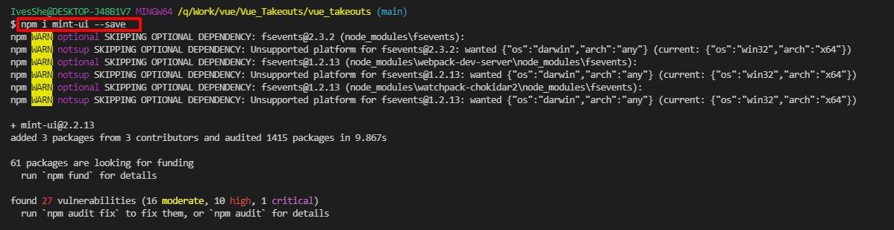

https://mint-ui.github.io/docs/#/en2/message-box

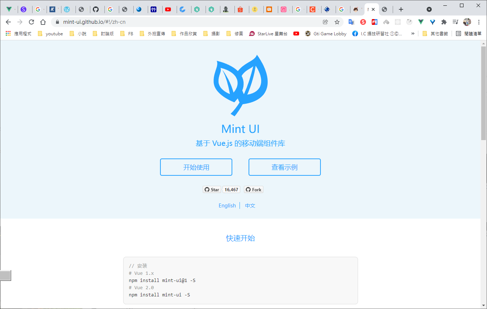

# 實現按需打包

```bash
npm i babel-plugin-component --save-dev
```

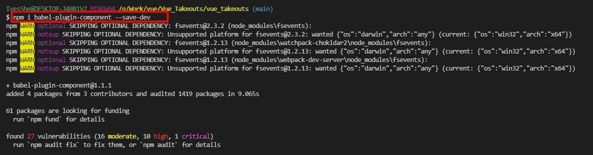

## babelrc

修改設定檔

```js
{
  "presets": [
    ["env", {
      "modules": false,
      "targets": {
        "browsers": ["> 1%", "last 2 versions", "not ie <= 8"]
      }
    }],
    "stage-2"
  ],
  "plugins": ["transform-vue-jsx", "transform-runtime", ["component", [
    {
      "libraryName": "mint-ui",
      "style": true
    }
  ]]]
}
```

## 註冊全局組件

main.js

```js
import {Button} from 'mint-ui'

// 註冊全局組件標籤
Vue.component(Button.name, Button)  // <mt-button></mt-button>
```

## 登入功能完成畫面

未登入

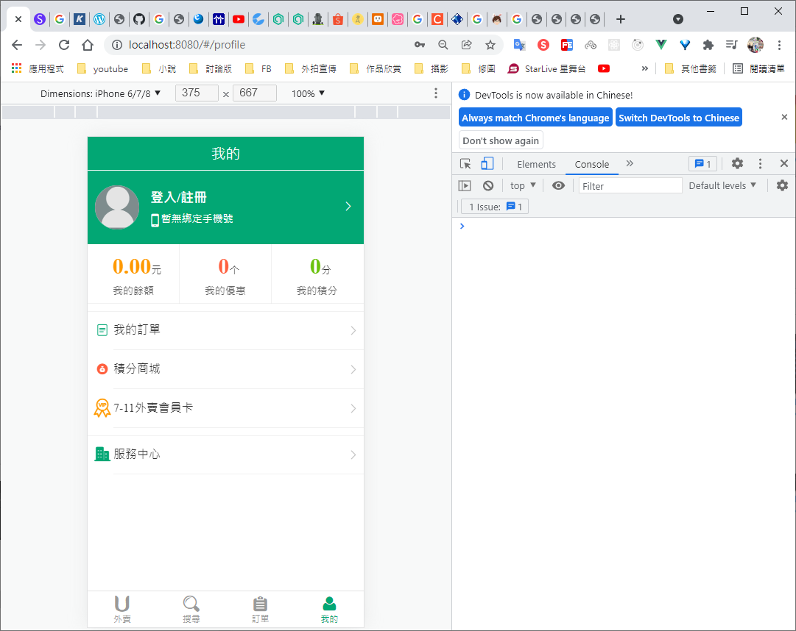

短信登入

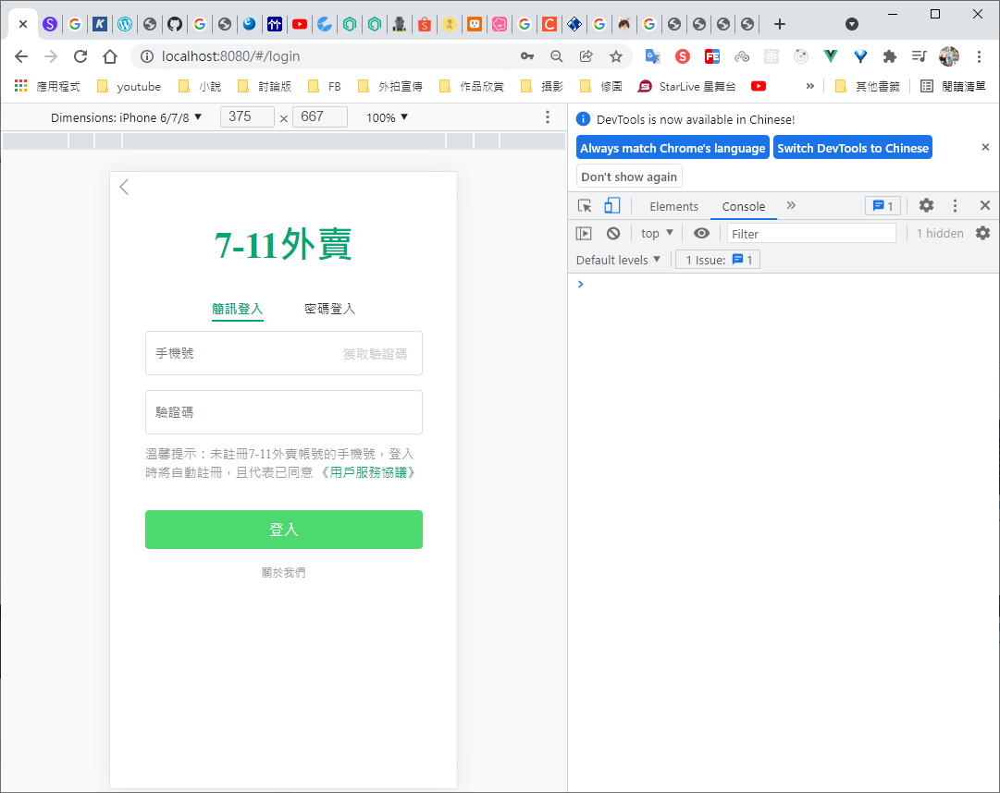

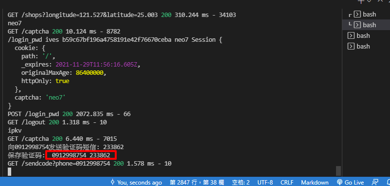

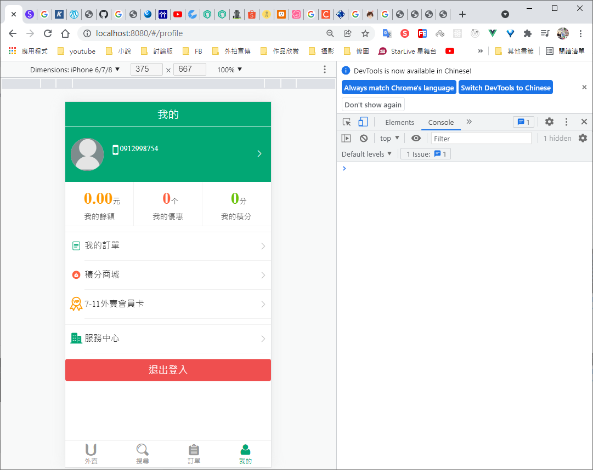

登出

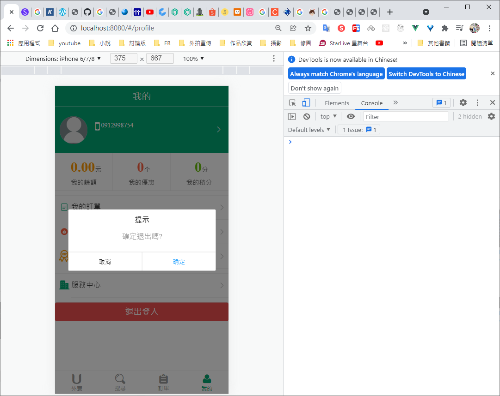

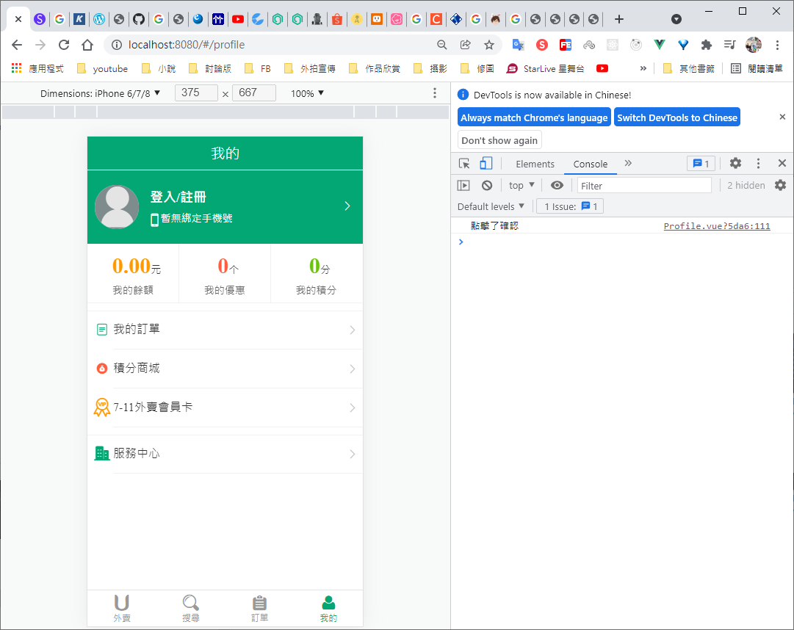


密碼登入

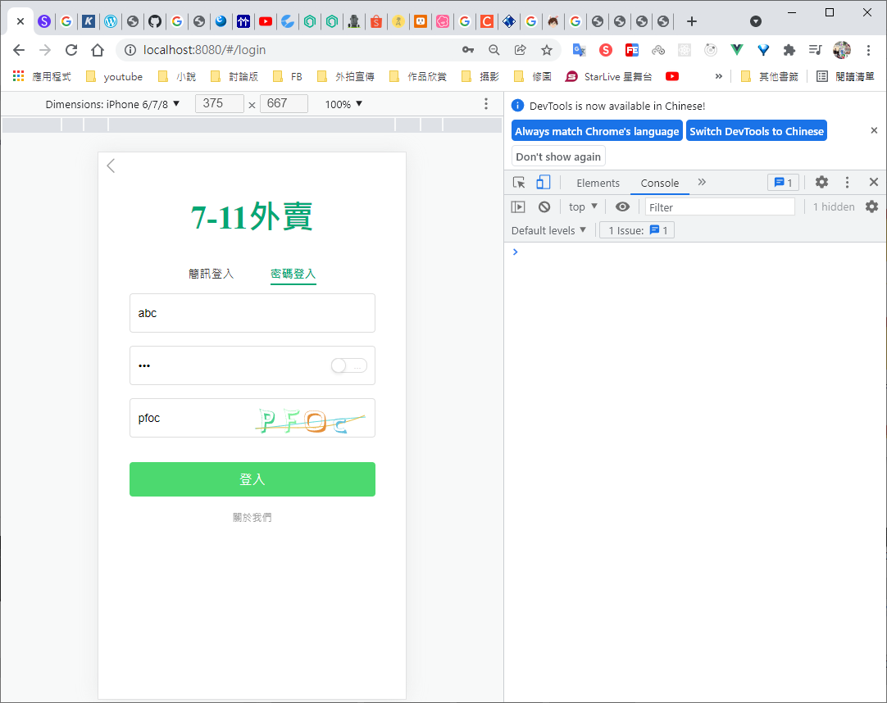

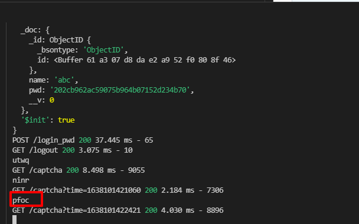

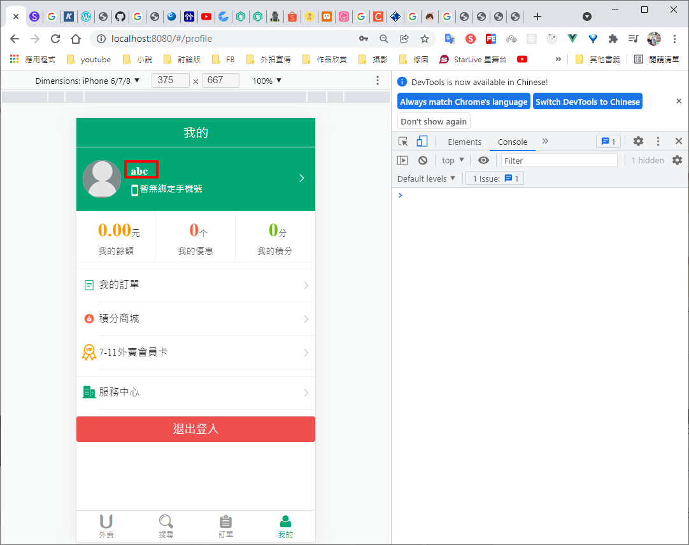

MSite畫面(上方左右元件)

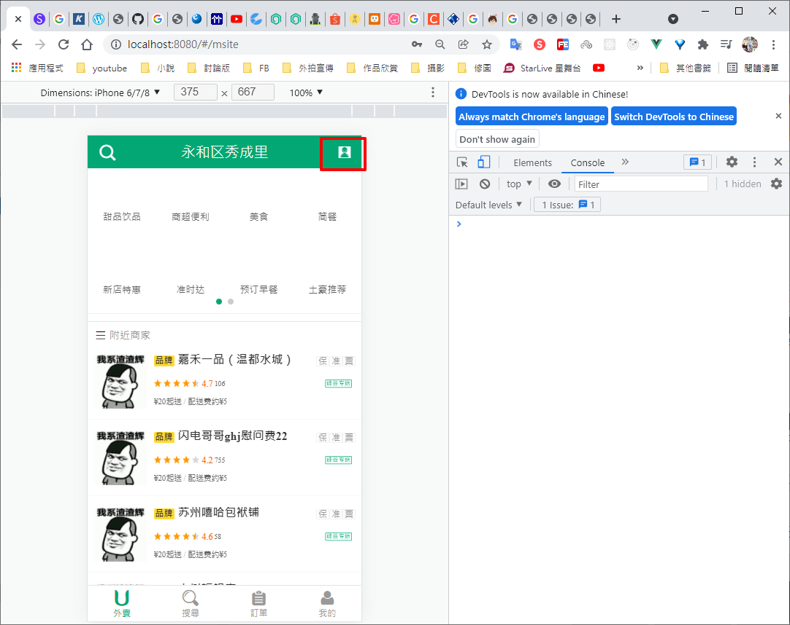

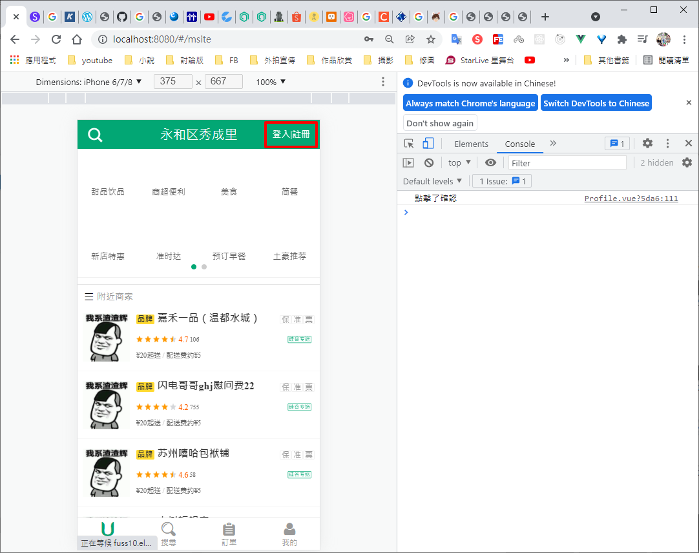